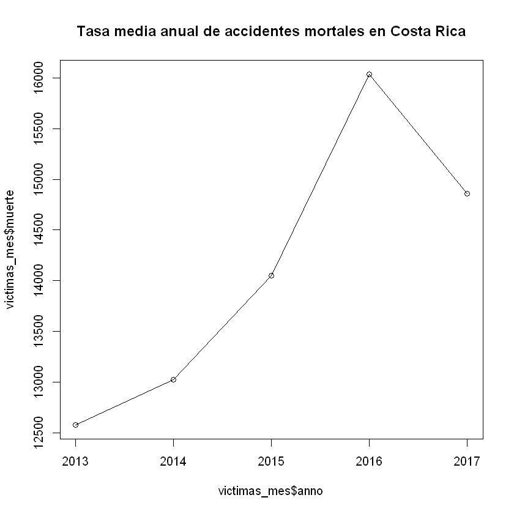
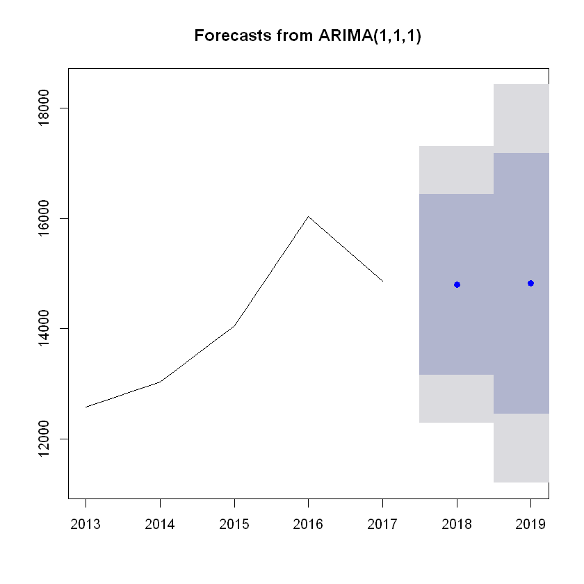

# Serie de tiempo
Una serie temporal o cronológica es una secuencia de datos, observaciones o valores, medidos en determinados momentos y ordenados cronológicamente. Los datos pueden estar espaciados a intervalos iguales (como la temperatura en un observatorio meteorológico en días sucesivos al mediodía) o desiguales (como el peso de una persona en sucesivas mediciones en el consultorio médico, la farmacia, etc.)

### Autores
   * Efrén Jiménez

## Análisis del Problema

##### Dirección General de Policía de Tránsito.

Los datos se obtienen mediante el  parte oficial de tránsito que realiza la Dirección General de Policía de Tránsito al presentarse un accidente, los cuales ingresan a la base de datos de dos formas (hand held y papel). Debido a que parte de la labor principal de la Institución es salvar vidas, y por los recursos limitados que existen, se trabaja solo con accidentes con heridos y/o fallecidos; y no se trabaja con accidentes que presentan solo daños materiales. Además, posteriormente inicia el proceso de limpieza, corrección de inconsistencias, validación de algunas variables,  georeferenciación de los accidentes, entre otros.


Accidente con víctima se refiere cuando en el accidente de tránsito al menos uno de los participantes resulto: herido leve, grave o fallecido.

Para más información revisar la metodología del documento Memoria estadística de accidentes de tránsito con víctimas.Periodo 2012-2014.


```R
#Librerias

# Cargar paquetes y funciones requeridos
#install.packages("dplyr")
require(dplyr)
require(repr)
require(forecast)
```

    Loading required package: repr
    Loading required package: forecast
    

## Entendimiento de los Datos

Con el fin de analizar y tratar de predecir los accidentes mortales en Costa Rica entre el 2013-2017 se detalle el entendimiento de los datos del dataset brindado.


- Clase de accidente : categórica
- Month : categórica ordinal  "February" "February" "February" "February" ...
- State : categórica ordinal  "Mississippi" "Mississippi" "Mississippi" "Mississippi" ...
- County: categórica ordinal  "Newton County" "Panola County" "Monroe County" "Hinds County" ...
- Rate  : numérica  6.1 9.4 7.9 6.1 10.6 6.9 7.9 14.3 4.5 11.1 ...


## Exploración de los Datos


```R
data <- read.csv('victimas.csv', header = TRUE, stringsAsFactors = TRUE, sep=";")
```


```R
## Lee el archivo csv
new_data<-data[,c(1,4)]
names(new_data)<-c("muerte","anno")
str(new_data)
summary(new_data)
```

    'data.frame':	70549 obs. of  2 variables:
     $ muerte: int  1 1 1 1 1 1 1 1 1 1 ...
     $ anno  : int  2015 2013 2013 2013 2013 2013 2013 2013 2013 2013 ...
    


         muerte       anno     
     Min.   :1   Min.   :2013  
     1st Qu.:1   1st Qu.:2014  
     Median :1   Median :2015  
     Mean   :1   Mean   :2015  
     3rd Qu.:1   3rd Qu.:2016  
     Max.   :1   Max.   :2017  


```R
victimas_mes <- new_data %>% group_by(anno)  %>% summarize(muerte = n())
```


```R
summary(victimas_mes)
```


          anno          muerte     
     Min.   :2013   Min.   :12576  
     1st Qu.:2014   1st Qu.:13025  
     Median :2015   Median :14050  
     Mean   :2015   Mean   :14110  
     3rd Qu.:2016   3rd Qu.:14861  
     Max.   :2017   Max.   :16037  


```R
anno = c(2013:2017)
```


```R
plot(victimas_mes$anno, victimas_mes$muerte,main = "Tasa media anual de accidentes mortales en Costa Rica")
lines(victimas_mes$anno, victimas_mes$muerte)
```





```R
muertes_cr.ts <- ts(victimas_mes$muerte, start = 2013, end=2017,freq = 1)
```


```R
str(muertes_cr.ts)
summary(muertes_cr.ts)
```

     Time-Series [1:5] from 2013 to 2017: 12576 13025 14050 16037 14861
    


       Min. 1st Qu.  Median    Mean 3rd Qu.    Max. 
      12576   13025   14050   14110   14861   16037 


```R
auto.arima(muertes_cr.ts)
```


    Series: muertes_cr.ts 
    ARIMA(0,0,0) with non-zero mean 
    
    Coefficients:
                mean
          14109.8000
    s.e.    558.9814
    
    sigma^2 estimated as 1952828:  log likelihood=-42.75
    AIC=89.5   AICc=95.5   BIC=88.72


```R
arima_model_victimas_cr= arima(muertes_cr.ts, order = c(1,1,1))
```


```R
muertes_cr.forecast <- forecast(arima_model_victimas_cr, h=2)
summary(muertes_cr.forecast)
plot(muertes_cr.forecast)
muertes_cr.forecast
```

    
    Forecast method: ARIMA(1,1,1)
    
    Model Information:
    
    Call:
    arima(x = muertes_cr.ts, order = c(1, 1, 1))
    
    Coefficients:
              ar1     ma1
          -0.2505  0.2865
    s.e.   6.0195  6.0724
    
    sigma^2 estimated as 1643378:  log likelihood = -34.3,  aic = 74.6
    
    Error measures:
                       ME     RMSE      MAE      MPE    MAPE      MASE       ACF1
    Training set 437.3336 1146.618 932.6399 2.916493 6.24942 0.8045201 -0.2979111
    
    Forecasts:
         Point Forecast    Lo 80    Hi 80    Lo 95    Hi 95
    2018       14800.83 13157.95 16443.70 12288.27 17313.39
    2019       14815.90 12450.34 17181.47 11198.09 18433.72
    


         Point Forecast    Lo 80    Hi 80    Lo 95    Hi 95
    2018       14800.83 13157.95 16443.70 12288.27 17313.39
    2019       14815.90 12450.34 17181.47 11198.09 18433.72





# Conclusiones 


```R
#- Para el año 2018 se predice un promedio de 
((12288.27+17313.39)/2)
#- Para el año 2019 se predice un promedio de 
((11198.09+18433.72)/2)
```


14800.83


14815.905

