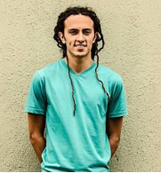
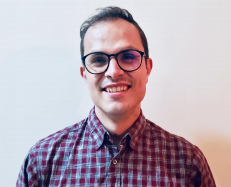
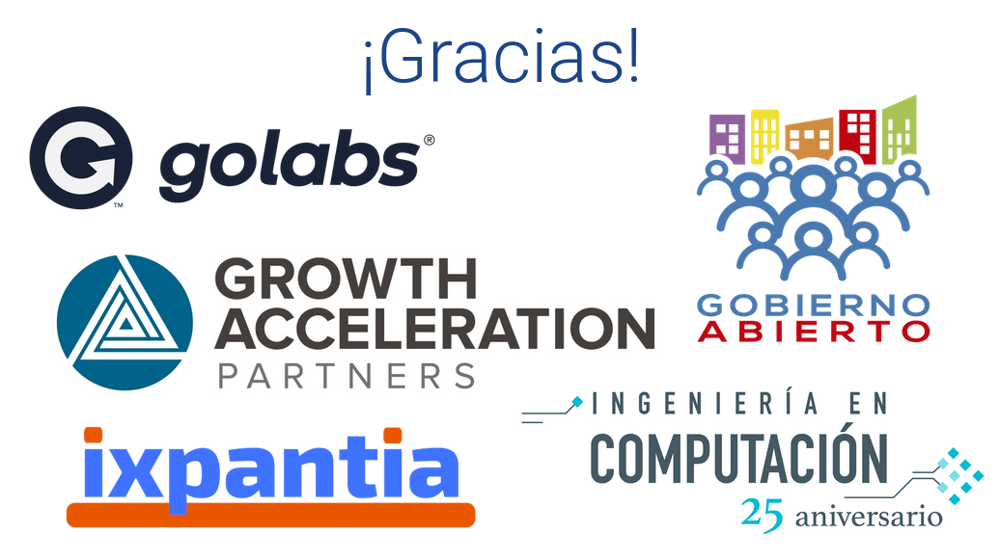

# Datatón Colaboración Ciudadana

Canal de comunicación: [comunidad gitter SCRUG](https://gitter.im/SCRUG/community) 

---

El Datatón fue un éxito total. Muchas gracias a todos por asistir. Ojalá logremos seguir la discusión, el aprendizaje y la generación de nuevo código y discusiones aqui! Queda mucho por entender de los datos, y de aprender sobre R.

Estamos trabajando sobre el [Libro Control Ciudadano](https://github.com/SCRUG/LCC/pull/4) donde buscamos recopilar los resultados de los diferentes grupos en un formato accesible y más fácil de compartir. Ven y ayúdanos allí para preparar el contenido, o solo para leer los resultados.

Si no estuviste en el Datatón pero quieres ayudar a completar los análisis que estamos preparando aquí, esta bienvenido. Búscanos en [gitter](https://gitter.im/SCRUG/community) para hablar.

---

El San Carlos R User Group (SCRUG) organiza el primer Datatón Colaboración Ciudadana en Costa Rica el 10 de Agosto de 2019. El objetivo es que los participantes realicen análisis exploratorios con los datos abiertos disponibles del gobierno de Costa Rica usando el lenguaje de programación R.

Vamos a trabajar en particular con los datos del [Poder Judicial](http://datosabiertospj.eastus.cloudapp.azure.com/dataset), [INAMU](https://www.inamu.go.cr/datosabiertos), el [MINAE](http://datosabiertos.presidencia.go.cr/dataviews/245078/ministerio-de-ambiente-y-energia-2018/) y el [SICOP](https://www.sicop.go.cr/index.jsp). Al iniciar el evento dividimos los participantes en áreas de interés comunes donde buscamos incluir en cada grupo usuarios R a diferentes nivel para crear un entorno de mentoría (los que más saben, ayudan a los que están recién iniciando).

Trabajaremos con [Rmarkdown](https://es.r4ds.hadley.nz/r-markdown.html) y toda la información y código que se genere será compartido a través de [Github](https://github.com/SCRUG/DCC). Al final del evento todos los reportes serán reunidos en un libro de formato libre que será publicado en línea en el sitio [bookdown.org](http://bookdown.org).

El objetivo es que todo trabajo pueda ser consultado por otros ciudadanos, se generen nuevas ideas y que además los autores de cada capítulo puedan ser contactados (si lo desean) para trabajar en más proyectos con datos abiertos. Es hacer comunidad y aportes desde la ciudadanía.

Haremos menciones especiales para los resultados a nivel de:

 - La mejor historia que lograron contar con datos sobre colaboración ciudadana.
 - La mejor visualización.
 - La exploración de datos con mayor apego al [estilo de código](http://adv-r.had.co.nz/Style.html)

*** 
## ¿Quieres participar? Regístrate en el formulario
El evento va ser en el CTEC del Tecnológico de Costa Rica, en Santa Clara de San Carlos. Si vienes de lejos, anúncialo porque quizás puedes encontrar posibilidades de compartir transporte. 

Tenemos un [tiquete en Github](https://github.com/SCRUG/DCC/issues/8) en el
cual podemos coordinar el transporte que estará disponible.

**[Registrate aqui](https://forms.gle/upj9GCyStGE3YRiU9)**

Por favor **no olvides registrarte** si te interesa participar y decirnos (aún si es el día antes) si por cualquier razón ya no vas a poder venir. Requiere bastante organización el que podamos trabajar en grupo y por eso necesitamos saber el tamaño del grupo (número de participantes) de antemano.

***

## ¿Qué necesitas llevar?

 - Computadora con [R](https://www.r-project.org/), [RStudio](https://www.rstudio.com/products/rstudio/download/) y [git](https://git-scm.com/) instalado (**últimas versiones**)
 - Un usuario en Github (hay instrucciones aquí)
 - Muchas ganas de aprender a la par de otros.
 - Mente curiosa.

#### ¿Que pasa si quiero participar pero no sé usar R o no tengo experiencia con datos?

¡No importa! **En el evento podrás aprender, colaborar y discutir ideas con otras personas que tienen más experiencia en estos temas**. ¡Solamente [hay que inscribirse](https://forms.gle/upj9GCyStGE3YRiU9)!

***

## Agenda Preliminar

La agenda está sujeta a cambios menores o inclusión de más detalles de las actividades.

 - **Fecha** : 10 de Agosto 2019
 - **Lugar**: [Campus Tecnológico local San Carlos (TEC Santa Clara), Costa Rica](https://www.tec.ac.cr/ubicaciones/sede-regional-san-carlos)
 - **Dirección en waze** Podrás usar esta [dirección en waze](https://www.waze.com/es/directions/costa-rica/santa-clara,-florencia/estacionamiento-ctec/180551784.1805452300.7258278.html) para llegar al datatón.

| Hora | Actividad |
|-----|---------------------------|
| 9:00 - 9:30 | Bienvenida al evento de parte de [ixpantia](https://www.ixpantia.com/es/), [golabs](https://www.go-labs.net/es/), [GAP](https://www.growthaccelerationpartners.com/) y [Gobierno Abierto](http://gobiernoabierto.go.cr/)|
| 9:30 - 10:00 | **Crear grupos de trabajo y explicar dinámica**. En los grupos dividimos las personas con diferentes niveles de experiencia para crear un entorno de mentoría (*mentoring*) donde los que saben más facilitan el camino para los que recién inician. |
| 10:00 - 12:00 | Primer !hack hack hack! - ¡A analizar y visualizar! |
| 12:00 - 13:00 | Almuerzo - **¡Ojo!** El almuerzo viene por cuenta de cada participante (a menos que conseguimos un patrocinador). Existe la soda del TEC que estará abierta el día del evento. |
| 13:00 - 14:00 | Último !hack hack hack! - Tiempo cierre de proyectos Espacio para terminar el análisis y las visualizaciones  |
| 14:00 - 15:00 | Presentaciones (informales) de los grupos - Contar la historia que obtuvieron, cuáles fueron los  puntos difíciles. |
| 15:00 - 15:30 | Cierre y premios (menciones de honor) - Cerramos y validamos que todo lo que se hizo está compartido en Github. |

***

## Código de conducta
Este [código de conducta](https://github.com/datos-abiertos-cr/orientacion/blob/master/codigo-de-conducta.md) aplica para este evento.

***

## Recursos

Tenemos recomendaciones que consideramos útiles para el el trabajo que desarrollaremos en el datatón.

| Tema | Recurso |
| ---- | ------- |
| Enlaces para materiales | https://github.com/SCRUG/DCC/blob/master/recursos.md |
| Instrucciones instalación software  | https://github.com/SCRUG/DCC/blob/master/instalacion_software.md |
| Recomendaciones para un EDA | https://github.com/SCRUG/DCC/blob/master/recomendaciones_eda.md |
| Uso de git | http://ronnyhdez.rbind.io/post/control-versiones-git/ |

***

## ¿Quienes organizan?

El datatón surge como idea a partir de un proyecto de fin de semana para
explorar datos abiertos. Conforme aumentó el interés en estos decidimos
abrirlo para aumentar la participación de personas inclinadas hacia la
ciencia de datos y los datos abiertos para así compartir lo que hemos aprendido en el camino y aprender de otros, es decir hacer crecer la
comunidad datera del país.

| Ronny Hernández Mora | Erick Calderón Morales | Frans van Dunné |
|--------------------- | ---------------------- | --------------- |
|  |  | 
| [Página personal](http://ronnyhdez.rbind.io/) | [Perfil Github](https://github.com/ecamo19)   | [Página personal](http://www.fransvandunne.com/) |

## Para patrocinadores

Agradecemos a las siguientes empresas y organizaciones por su apoyo al
evento:

